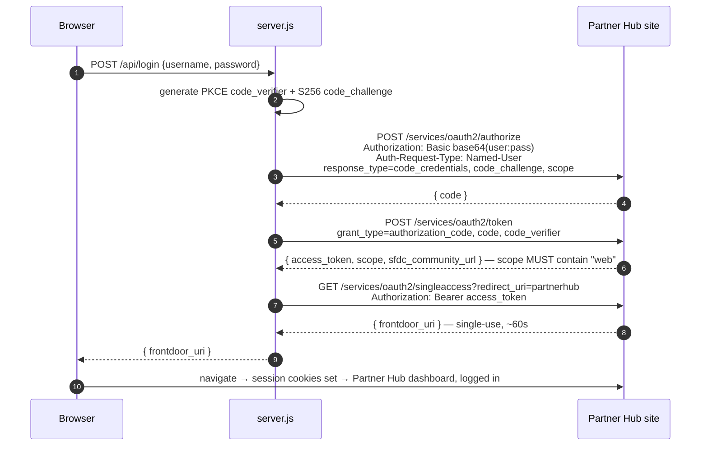

# Blackboard Integration Partner Website

Static HTML/CSS/JS plus a small, zero-dependency Node backend (`server.js`). **Not**
Salesforce metadata — this folder is never listed in `sfdx-project.json`
`packageDirectories` and is deployed separately from `blackboard-demo-app` /
`force-app`.

"Client Login" logs a partner into the **Partner Hub** Experience Cloud portal
using Salesforce's **Headless Identity API**, then bridges that session into the
real portal UI so the visitor lands on the dashboard already logged in. "Become a
Partner" creates a standard `Lead` record via a guest Apex REST endpoint.

Reference: Salesforce ["Headless Identity Implementation
Guide"](https://developer.salesforce.com/docs/atlas.en-us.headless_identity.meta/headless_identity/headless_identity_login_overview.htm)
(Authorization Code and Credentials Flow) and ["Generate a Frontdoor URL to Bridge
into UI
Sessions"](https://help.salesforce.com/s/articleView?id=xcloud.frontdoor_singleaccess.htm&language=en_US&type=5)
(Single Access UI Bridge API). Reference implementation: `primary-capital-website/`
on branch `origin/IndustrySpec/FSC`, which this folder mirrors closely.

## Run it

```
npm start
```

Runs `server.js` (plain Node, no dependencies, Node 18+ for global `fetch`) at
`http://localhost:5500`. `npm start` does **not** load `.env` automatically — either
export the variables in your shell first, or run with Node's own env-file flag
(Node 20.6+):

```
node --env-file=.env server.js
```

Everything in `.env.example` has a working default for the BlackBoarDemo scratch
org baked into `server.js`, **except `SF_CLIENT_ID`**, which has no default and
makes the server refuse to start until it is set. Copy `.env.example` to `.env` and
fill that one value in (see the checklist below for where it comes from).

Deploying this needs somewhere that can run a small Node process or function
(Vercel/Netlify function, small Node host) — not plain static hosting, because
`/api/login` and `/api/lead` are server routes. `vercel.json` is ready for a Vercel
deploy but that deploy is **not** part of this work — see the plan doc.

## How login works

The **entire** Salesforce flow runs server-side in `server.js`. The browser posts
`{ username, password }` to `POST /api/login` and gets back one thing: a
single-use, ~1-minute `frontdoor_uri` to navigate to.



**Why it all lives server-side.** `/services/oauth2/singleaccess` does not support
CORS at all — it is not on Salesforce's [CORS-enabled OAuth endpoint
list](https://help.salesforce.com/s/articleView?id=sf.remoteaccess_oauth_endpoints_cors.htm&language=en_US&type=5)
— so a backend is mandatory regardless. Running the earlier legs here too means: no
CORS allowlist entry and no "Enable CORS for OAuth endpoints" switch (the largest
source of setup failures for this flow), the `web`-scoped access token never
reaches the browser, and no route accepts a client-supplied Salesforce host.

## Configuration (all overridable by env var — see `.env.example` for the full,
commented list)

| Variable | Default | Notes |
| --- | --- | --- |
| `SF_ORIGIN` | `https://agility-power-1332-dev-ed.scratch.my.site.com` | Origin only, no path |
| `SF_SITE_PATH` | `partnerhub` | **Browsable** LWR prefix — all three OAuth calls use this, not the `vforcesite` form |
| `SF_CALLBACK_URL` | `<origin>/partnerhubvforcesite/services/oauth2/echo` | Must match the External Client App's registered Callback URL byte for byte. Registered value only — never navigated to |
| `SF_SCOPES` | `openid api web` | **Space**-separated. `web` is mandatory. Every scope here must also be selected on the app |
| `SF_LANDING_ROUTE` | *(empty)* | The Partner Hub portal home forwards a signed-in visitor to the dashboard on its own |
| `SF_CLIENT_ID` | *(none — required)* | Read from Setup after the External Client App deploys. Server refuses to start without it |
| `SF_LEAD_ENDPOINT` | `https://agility-power-1332-dev-ed.scratch.my.site.com/services/apexrest/Chgon/bb/v1/lead` | Guest Apex REST endpoint that creates the Lead |
| `PORT` | `5500` | Local dev port only, unused on Vercel |
| `SF_FETCH_TIMEOUT_MS` | `15000` | Timeout on every outbound Salesforce call |

### ⚠️ The two site prefixes are not interchangeable

The Network metadata's `<urlPathPrefix>` is `partnerhubvforcesite` — the
auto-generated Visualforce-hosting companion prefix, **not** the browsable portal
URL. The portal itself is served at `/partnerhub/`. The **callback URL** is
registered under the `vforcesite` prefix, while `SF_SITE_PATH` (used for all three
OAuth calls and the landing route) is the short form, `partnerhub`. Getting these
backwards is the single most common failure mode for this flow — see FSC's own
README, which hit the identical issue on its org.

## API routes

### `POST /api/login`

Request:
```json
{ "username": "alex.rivera@lumenlearn.example", "password": "..." }
```

Success response (`200`):
```json
{ "frontdoor_uri": "https://.../secur/frontdoor.jsp?sid=..." }
```

Failure response (`401` for a rejected credential or a Salesforce-side error,
`503` if Salesforce could not be reached, `400` for a malformed/incomplete
request):
```json
{ "error": "Invalid username or password." }
```

A wrong password gets exactly the string above. Every other failure — a
misconfigured client id, a missing scope, a network timeout — gets a generic
message on the wire; the real cause is always logged server-side with a leg label
(`login/authorize`, `login/token`, `login/singleaccess`).

### `POST /api/lead`

Request — `websiteUrl` is a honeypot field, forwarded exactly as received:
```json
{
  "firstName": "Jordan",
  "lastName": "Lee",
  "company": "Acme LMS Integrations",
  "email": "jordan@acme.example",
  "phone": "+1 555 0100",
  "country": "United States",
  "tier": "Gold",
  "message": "We'd like to integrate our gradebook.",
  "websiteUrl": ""
}
```

Success response (`200`):
```json
{ "ok": true, "leadId": "00Q..." }
```

Failure response (`200` for an Apex-side rejection, `502` if Salesforce could not
be reached, `413` if the body exceeds ~64KB, `400` for malformed JSON):
```json
{ "ok": false, "error": "We could not submit your application. Please try again." }
```

The server never relays Apex's raw error text to the browser; the real response is
logged server-side. The server also does **not** attempt its own bot detection —
the honeypot field is passed straight through, and Apex re-validates everything.

### `GET /portal-login`

`302` to the Partner Hub **home** (`SF_ORIGIN/SF_SITE_PATH/`), not `/login` — a
visitor already signed in (in any tab) goes straight in; a signed-out visitor is
sent on to the login page by the portal itself.

### `GET /*`

Static file serving from this folder. `index.html` for `/`, correct
`Content-Type` for `.html/.css/.js/.svg/.png/.ico`, and any resolved path that
would escape the site root is rejected with `403`.

## Org-side setup checklist (cannot be done from source)

1. **Deploy the metadata** in `blackboard-demo-app/main/default/` — the External
   Client App (`Blackboard_Partner_Website`), its OAuth settings and policy, the
   `Partner Hub` network's `networkAuthApiSettings`, `BbHeadlessUserDiscoveryHandler`,
   `BbLeadIntakeRest`, and the `Bb_Public_Site` permission set additions. See the
   plan doc (`documentation/AI-agent-code-work/blackboard-integration-partner-renewal-demo/15-...md`
   §6) for the exact file list.
2. **Setup → Identity → OAuth and OpenID Connect Settings → turn ON "Allow
   Authorization Code and Credentials Flows."** This is an org-wide switch; the
   External Client App's own flag alone is not enough.
3. **Copy the Consumer Key** from Setup → External Client App Manager →
   `Blackboard_Partner_Website` → Settings → OAuth → Manage Consumer Details, into
   `.env` as `SF_CLIENT_ID`.
4. **Confirm the guest profile** backing the Apex REST site has class access to
   `BbLeadIntakeRest` (granted by the `Bb_Public_Site` permission set additions —
   assignment to the guest user is a separate step from deploying the permission
   set and is easy to miss).
5. Confirm the External Client App has:
   - Callback URL exactly `SF_CALLBACK_URL` above.
   - Scopes: Access unique user identifiers (openid) + Manage user data via APIs
     (api) + Allow access to your data via the Web (web).
   - "Require Secret for Web Server Flow" / "Require Secret for Refresh Token
     Flow" **unchecked** — this is a public client (PKCE-only).
   - "Require user credentials in the POST body" **unchecked** — `server.js` sends
     credentials in the `Authorization: Basic` header; if this box is checked the
     header is ignored and Salesforce falls back to interactive login.
   - "Issue JSON Web Token (JWT)-based access tokens" **off** — breaks the
     `singleaccess` bridge.
   - "Require Proof Key for Code Exchange (PKCE)" **on** — `server.js` always
     sends a `code_challenge`.
   - Permitted Users = "Admin approved users are pre-authorized", with the
     Partner Hub end-user profile added under Manage Profiles (avoids a consent
     screen).
6. **Connected app / External Client App changes take up to ~10 minutes to
   propagate.** Retesting immediately after a scope or policy change gives stale
   results.

## Known limitations

- **MFA is unsupported.** The headless username-password flow cannot satisfy an
  MFA challenge — demo users must have MFA off.
- **Password collection on a third-party domain.** This design has visitors type
  their Salesforce portal password into a non-Salesforce page, relayed
  server-side by `server.js`. The lower-risk alternative Salesforce recommends for
  Experience Cloud is federated SSO — the external site as an OIDC/SAML IdP behind
  a Salesforce Auth Provider. Worth revisiting before any production use.

## Troubleshooting

`server.js` logs each step and surfaces Salesforce's own error text server-side —
check the process logs first.

| Symptom | Cause |
| --- | --- |
| Salesforce returns an **HTML login page** from `/authorize` | The request stopped being treated as headless. A scope in `SF_SCOPES` is not selected on the External Client App, "Require user credentials in the POST body" is checked, or "Allow Authorization Code and Credentials Flows" is off. |
| `redirect_uri_mismatch` | `SF_CALLBACK_URL` doesn't exactly match the app's registered Callback URL. |
| `invalid_client_id` | `SF_CLIENT_ID` names a different org than `SF_ORIGIN`. Easy to mistake for a bad password — check this first if every login fails identically. |
| `invalid_grant` / `authentication failure` | Wrong username or password. |
| Token issued with scope lacking `web` | The `web` scope isn't selected on the app (or the change hasn't propagated yet). `server.js` fails with an explicit message here rather than letting the next step return a cryptic `Invalid_Scope`. |
| `Invalid_Scope` from `singleaccess` | Same cause as above. |
| `Invalid_Param` from `singleaccess` | `redirect_uri` was absolute, or otherwise not a valid relative path. |
| `Bad_OAuth_Token` | Token expired, or the user has the API Only User permission. |
| `No_Access` / `Wrong_Org` | `singleaccess` was called against a different domain than the one that issued the token. |
| Bridge succeeds but lands on "Invalid Page" / 404 | The landing route isn't a real one. Prefix must be `partnerhub` (not `partnerhubvforcesite`). |
| Bridge worked once, then stopped | `frontdoor_uri` is single-use and expires in ~1 minute. |
| `/api/lead` always returns the generic failure | Check the server log for the real Apex response — most likely the guest profile lacks class access to `BbLeadIntakeRest` (checklist item 4), or a required Lead field failed validation. |
| Server exits immediately on `npm start` | `SF_CLIENT_ID` is not set. See "Run it" above. |

## Pages

`index.html`, `tiers.html`, `become-a-partner.html`, `styles.css`, `main.js`, and
`assets/` are owned by a different piece of this work (see the plan doc) — this
README covers only `server.js`, `headless-login.js`, and `lead-form.js`.

## Org reference (BlackBoarDemo scratch org, expires 2026-10-15)

- Portal home: `https://agility-power-1332-dev-ed.scratch.my.site.com/partnerhub/`
- This is a scratch org — the domain differs per environment and changes again if
  this ever points at a different org.
